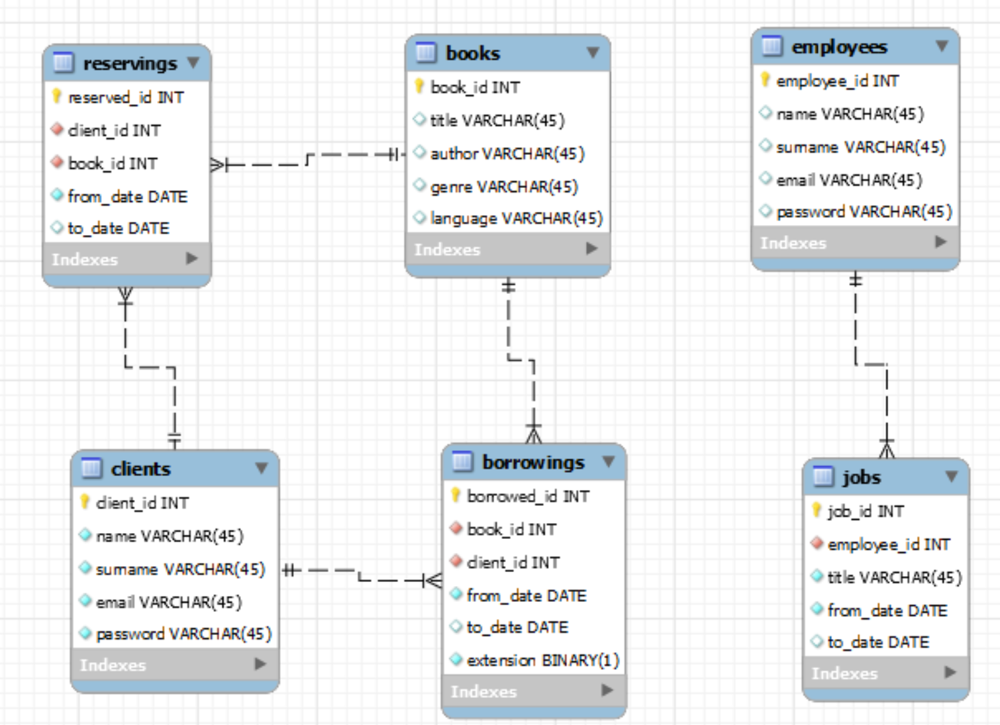

# The_Library
> A library management system in Mysql Database and Python.

## Description
An application with a graphical interface that automates the entire process of managing the library, making it efficient and convenient for the library staff and users. The system provides an easy way to manage books, borrowers, and library staff.

## Features
* Book management: add, edit, and delete books, view book details, and manage book copies.
* Borrower management: add, edit, and delete borrowers, view borrower details, and manage borrowing history.
* Library staff management: add, edit, and delete staff, view staff details, and manage staff permissions.
* Borrowing management: manage book borrowing, return, and renewal, and view borrowing history.
* Reservation management: manage book reservations, view reservation details, and notify borrowers of book availability.

### Database model

## Getting Started
To get started, follow these instructions:

1. Clone the repository to your local machine.
2. Install the necessary dependencies by running `pip install -r requirements.txt` in the project directory.
3. Run `main.py` to start the application.
